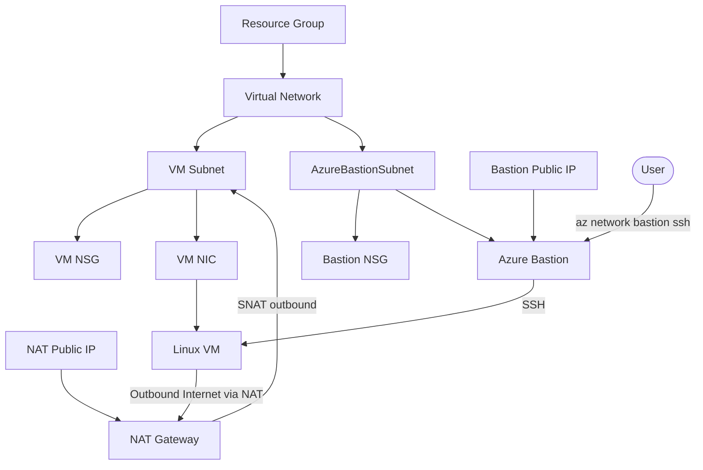

# ch02: Azure Bastion 経由で Linux VM に SSH する

このディレクトリは、Azure Bastion 経由でのみ SSH 接続する最小構成の Linux VM を Terraform で作成します。

## 作成する主なリソース

- Resource Group
- Virtual Network
- VM 用 subnet
- `AzureBastionSubnet`
- VM subnet 用 NSG
- Azure Bastion subnet 用 NSG
- Azure Bastion 用 Public IP
- Azure Bastion
- NAT Gateway 用 Public IP
- NAT Gateway
- VM Subnet NAT Gateway 関連付け
- Network Interface
- Linux VM

VM には Public IP を付けません。SSH は Azure Bastion 経由で行います。
VM からインターネットへのアウトバウンド通信（`apt-get update` など）は NAT Gateway 経由で行います。

## リソース関係図



## 前提

- Terraform がインストールされていること
- Azure CLI でログイン済みであること
- 既存の SSH 公開鍵があること

```bash
az login
ls ~/.ssh/id_ed25519.pub
```

別の公開鍵を使う場合は `-var="ssh_public_key_path=/path/to/key.pub"` を指定します。

mise を利用している場合は、リポジトリルートの `mise.toml` で Terraform / Azure CLI / tflint / Trivy のバージョンが固定されます。

## 使い方

```bash
terraform init
terraform fmt
terraform validate
terraform plan
terraform apply
```

`ch02` の外から実行する場合は次のようにします。

```bash
terraform -chdir=ch02 init
terraform -chdir=ch02 validate
terraform -chdir=ch02 apply
```

## Makefile を使った場合

リポジトリのルートから `make` で各 Terraform 操作を実行できます。Makefile は `mise exec -- terraform` を利用するため、ルートの `mise.toml` で指定されたバージョンの Terraform / Azure CLI が使用されます。

```bash
make help
make lint
```

| ターゲット | 説明 |
|------------|------|
| `help` | 利用可能なターゲットを表示 |
| `init` | `terraform init` を実行 |
| `fmt` | `terraform fmt` を実行 |
| `validate` | `terraform validate` を実行 |
| `lint` | `tflint` と `trivy` を使って設定を静的解析・脆弱性スキャン（HIGH/CRITICAL）を実行 |
| `plan` | `terraform plan` を実行 |
| `apply` | `terraform apply` を実行 |
| `destroy` | VM / NIC / Bastion / NAT Gateway / Public IP など有料リソースのみを削除。RG・VNet・subnet・NSG は保持します |
| `destroy-all` | `terraform destroy` を実行し、すべてのリソースを削除 |
| `ssh` | Azure Bastion 経由で VM に SSH 接続（`SSH_KEY` で秘密鍵を上書き可能） |

各ターゲットはリポジトリルートから `make <ターゲット名>` で実行できます。`destroy` と `destroy-all` は確認プロンプトが表示されます。Terraform の挙動は通常通り維持されます。

## Bastion 経由の SSH

apply 後に出力される `azure_cli_bastion_ssh_example` を参考にするか、`make ssh` を実行します。

```bash
make ssh
```

秘密鍵のパスが `~/.ssh/id_ed25519` ではない場合は、`SSH_KEY` 環境変数で上書きします。

```bash
make ssh SSH_KEY=/path/to/your/key
```

Azure Portal から接続する場合は、VM の画面で Bastion 接続を選び、ユーザー名と秘密鍵を指定します。

## VM からのアウトバウンド通信確認

Bastion 経由で VM に SSH した後、次のように外向き通信を確認できます。

```bash
curl -s ifconfig.me
sudo apt-get update
```

`curl -s ifconfig.me` の結果は Terraform output の `nat_gateway_public_ip_address` と一致する想定です。

## 片付け

```bash
terraform destroy
```

## State について

この章では学習しやすいように local state を使います。`terraform.tfstate` は Git にコミットしないでください。

将来 Azure Storage Account backend に移行する場合は、backend 用の Storage Account / Container を作成し、`terraform { backend "azurerm" {} }` を追加してから `terraform init -migrate-state` を実行します。
