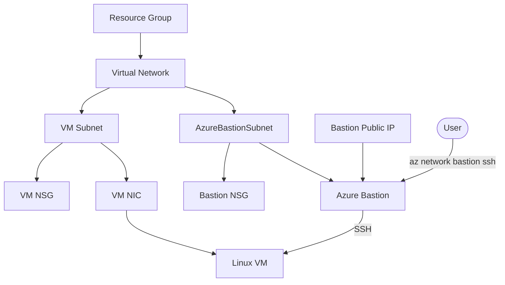

# Azure Bastion VM Implementation Plan

> **For agentic workers:** REQUIRED SUB-SKILL: Use superpowers:subagent-driven-development (recommended) or superpowers:executing-plans to implement this plan task-by-task. Steps use checkbox (`- [ ]`) syntax for tracking.

**Goal:** Create a `ch02/` Terraform root module that provisions a minimal Azure Linux VM reachable by SSH through Azure Bastion.

**Architecture:** The module will create one resource group, one VNet, a VM subnet, the required `AzureBastionSubnet`, NSGs, Azure Bastion, a private Linux VM, and focused outputs. Terraform will use local state initially, while keeping provider and file boundaries easy to migrate to an Azure Storage backend later.

**Tech Stack:** Terraform, HashiCorp AzureRM provider, Azure Virtual Network, Azure Bastion, Azure Linux VM, NSG, existing SSH public key.

---

## File Structure

- Create `.gitignore`: ignore Terraform state, plans, local variable files, and provider working directories.
- Create `ch02/versions.tf`: Terraform and AzureRM provider constraints.
- Create `ch02/providers.tf`: AzureRM provider configuration using ambient Azure CLI/auth credentials.
- Create `ch02/variables.tf`: inputs for location, naming prefix, address ranges, VM size, admin username, SSH public key path, and tags.
- Create `ch02/main.tf`: all Azure resources for the learning environment.
- Create `ch02/outputs.tf`: useful outputs for SSH/Bastion learning.
- Create `ch02/README.md`: setup, apply, Bastion SSH guidance, cleanup, and future backend migration note.

## Design Decisions

- Use existing SSH public key via `file(var.ssh_public_key_path)`.
- Do not assign a public IP to the VM.
- Use local Terraform state by omitting a backend block.
- Use `AzureBastionSubnet` with `/26` prefix.
- Attach an NSG to the VM subnet and allow TCP/22 only from the Bastion subnet CIDR.
- Attach a compliant NSG to `AzureBastionSubnet` with the required Azure Bastion control/data-plane rules.
- Use a small Ubuntu Linux VM, defaulting to `Standard_B1s`.

### Task 1: Add Terraform ignore rules

**Files:**
- Create: `.gitignore`

- [ ] **Step 1: Create `.gitignore`**

```gitignore
# Terraform working directories
**/.terraform/*

# Terraform state
*.tfstate
*.tfstate.*

# Terraform variable files that may contain local choices or secrets
*.tfvars
*.tfvars.json

# Terraform plan files
*.tfplan
tfplan

# Terraform CLI override files
override.tf
override.tf.json
*_override.tf
*_override.tf.json

# Local Terraform CLI config
.terraformrc
terraform.rc
```

- [ ] **Step 2: Verify ignore rules include state files**

Run: `git check-ignore ch02/terraform.tfstate ch02/example.tfvars`

Expected: both paths are printed as ignored.

### Task 2: Add provider and variable definitions

**Files:**
- Create: `ch02/versions.tf`
- Create: `ch02/providers.tf`
- Create: `ch02/variables.tf`

- [ ] **Step 1: Create `ch02/versions.tf`**

```hcl
terraform {
  required_version = ">= 1.6.0"

  required_providers {
    azurerm = {
      source  = "hashicorp/azurerm"
      version = "~> 4.78"
    }
  }
}
```

- [ ] **Step 2: Create `ch02/providers.tf`**

```hcl
provider "azurerm" {
  features {}
}
```

- [ ] **Step 3: Create `ch02/variables.tf`**

```hcl
variable "location" {
  description = "Azure region for all resources."
  type        = string
  default     = "japaneast"
}

variable "name_prefix" {
  description = "Prefix used for resource names. Use lowercase letters, numbers, and hyphens."
  type        = string
  default     = "az-km"

  validation {
    condition     = can(regex("^[a-z0-9-]{3,24}$", var.name_prefix))
    error_message = "name_prefix must be 3-24 characters and contain only lowercase letters, numbers, and hyphens."
  }
}

variable "admin_username" {
  description = "Admin username for the Linux VM."
  type        = string
  default     = "haru256"
}

variable "ssh_public_key_path" {
  description = "Path to an existing SSH public key file, such as ~/.ssh/id_ed25519.pub."
  type        = string
  default     = "~/.ssh/id_ed25519.pub"
}

variable "vm_size" {
  description = "Azure VM size for the learning VM."
  type        = string
  default     = "Standard_B1s"
}

variable "vnet_address_space" {
  description = "Address space for the virtual network."
  type        = list(string)
  default     = ["10.0.0.0/16"]
}

variable "vm_subnet_address_prefixes" {
  description = "Address prefixes for the VM subnet."
  type        = list(string)
  default     = ["10.0.1.0/24"]
}

variable "bastion_subnet_address_prefixes" {
  description = "Address prefixes for AzureBastionSubnet. Azure Bastion requires /26 or larger."
  type        = list(string)
  default     = ["10.0.2.0/26"]
}

variable "tags" {
  description = "Tags applied to supported resources."
  type        = map(string)
  default = {
    chapter = "ch02"
    purpose = "azure-bastion-learning"
  }
}
```

- [ ] **Step 4: Format the new Terraform files**

Run: `terraform -chdir=ch02 fmt`

Expected: command exits 0 and formats the three files.

### Task 3: Add Azure networking, Bastion, and VM resources

**Files:**
- Create: `ch02/main.tf`

- [ ] **Step 1: Create `ch02/main.tf`**

```hcl
# 全リソースを格納するリソースグループ
resource "azurerm_resource_group" "this" {
  name     = "${var.name_prefix}-rg"
  location = var.location
  tags     = var.tags
}

# Linux VM と Bastion を配置する仮想ネットワーク
resource "azurerm_virtual_network" "this" {
  name                = "${var.name_prefix}-vnet"
  address_space       = var.vnet_address_space
  location            = azurerm_resource_group.this.location
  resource_group_name = azurerm_resource_group.this.name
  tags                = var.tags
}

# Linux VM を配置するサブネット
resource "azurerm_subnet" "vm" {
  name                 = "vm-subnet"
  resource_group_name  = azurerm_resource_group.this.name
  virtual_network_name = azurerm_virtual_network.this.name
  address_prefixes     = var.vm_subnet_address_prefixes
}

# Azure Bastion を配置する専用サブネット（名前は AzureBastionSubnet が必須）
resource "azurerm_subnet" "bastion" {
  name                 = "AzureBastionSubnet"
  resource_group_name  = azurerm_resource_group.this.name
  virtual_network_name = azurerm_virtual_network.this.name
  address_prefixes     = var.bastion_subnet_address_prefixes
}

# VM サブネットへの SSH を Bastion サブネットからのみ許可する NSG
resource "azurerm_network_security_group" "vm" {
  name                = "${var.name_prefix}-vm-nsg"
  location            = azurerm_resource_group.this.location
  resource_group_name = azurerm_resource_group.this.name
  tags                = var.tags

  security_rule {
    name                       = "AllowSshFromBastionSubnet"
    priority                   = 100
    direction                  = "Inbound"
    access                     = "Allow"
    protocol                   = "Tcp"
    source_port_range          = "*"
    destination_port_range     = "22"
    source_address_prefix      = var.bastion_subnet_address_prefixes[0]
    destination_address_prefix = "*"
  }
}

# Azure Bastion が動作するために必要な制御・データプレーン通信を許可する NSG
resource "azurerm_network_security_group" "bastion" {
  name                = "${var.name_prefix}-bastion-nsg"
  location            = azurerm_resource_group.this.location
  resource_group_name = azurerm_resource_group.this.name
  tags                = var.tags

  security_rule {
    name                       = "AllowHttpsInboundFromInternet"
    priority                   = 100
    direction                  = "Inbound"
    access                     = "Allow"
    protocol                   = "Tcp"
    source_port_range          = "*"
    destination_port_range     = "443"
    source_address_prefix      = "Internet"
    destination_address_prefix = "*"
  }

  security_rule {
    name                       = "AllowGatewayManagerInbound"
    priority                   = 110
    direction                  = "Inbound"
    access                     = "Allow"
    protocol                   = "Tcp"
    source_port_range          = "*"
    destination_port_range     = "443"
    source_address_prefix      = "GatewayManager"
    destination_address_prefix = "*"
  }

  security_rule {
    name                       = "AllowAzureLoadBalancerInbound"
    priority                   = 120
    direction                  = "Inbound"
    access                     = "Allow"
    protocol                   = "Tcp"
    source_port_range          = "*"
    destination_port_range     = "443"
    source_address_prefix      = "AzureLoadBalancer"
    destination_address_prefix = "*"
  }

  security_rule {
    name                       = "AllowBastionHostCommunicationInbound"
    priority                   = 130
    direction                  = "Inbound"
    access                     = "Allow"
    protocol                   = "*"
    source_port_range          = "*"
    destination_port_ranges    = ["8080", "5701"]
    source_address_prefix      = "VirtualNetwork"
    destination_address_prefix = "VirtualNetwork"
  }

  security_rule {
    name                       = "AllowSshRdpOutboundToVirtualNetwork"
    priority                   = 100
    direction                  = "Outbound"
    access                     = "Allow"
    protocol                   = "*"
    source_port_range          = "*"
    destination_port_ranges    = ["22", "3389"]
    source_address_prefix      = "*"
    destination_address_prefix = "VirtualNetwork"
  }

  security_rule {
    name                       = "AllowAzureCloudOutbound"
    priority                   = 110
    direction                  = "Outbound"
    access                     = "Allow"
    protocol                   = "Tcp"
    source_port_range          = "*"
    destination_port_range     = "443"
    source_address_prefix      = "*"
    destination_address_prefix = "AzureCloud"
  }

  security_rule {
    name                       = "AllowBastionHostCommunicationOutbound"
    priority                   = 120
    direction                  = "Outbound"
    access                     = "Allow"
    protocol                   = "*"
    source_port_range          = "*"
    destination_port_ranges    = ["8080", "5701"]
    source_address_prefix      = "VirtualNetwork"
    destination_address_prefix = "VirtualNetwork"
  }

  security_rule {
    name                       = "AllowSessionInformationOutbound"
    priority                   = 130
    direction                  = "Outbound"
    access                     = "Allow"
    protocol                   = "Tcp"
    source_port_range          = "*"
    destination_port_range     = "80"
    source_address_prefix      = "*"
    destination_address_prefix = "Internet"
  }
}

# VM サブネットと NSG を関連付ける
resource "azurerm_subnet_network_security_group_association" "vm" {
  subnet_id                 = azurerm_subnet.vm.id
  network_security_group_id = azurerm_network_security_group.vm.id
}

# AzureBastionSubnet と NSG を関連付ける
resource "azurerm_subnet_network_security_group_association" "bastion" {
  subnet_id                 = azurerm_subnet.bastion.id
  network_security_group_id = azurerm_network_security_group.bastion.id
}

# Azure Bastion に割り当てる静的なパブリック IP
resource "azurerm_public_ip" "bastion" {
  name                = "${var.name_prefix}-bastion-pip"
  location            = azurerm_resource_group.this.location
  resource_group_name = azurerm_resource_group.this.name
  allocation_method   = "Static"
  sku                 = "Standard"
  tags                = var.tags
}

# パブリック IP 経由で SSH/RDP 接続を中継する Azure Bastion ホスト
resource "azurerm_bastion_host" "this" {
  name                = "${var.name_prefix}-bastion"
  location            = azurerm_resource_group.this.location
  resource_group_name = azurerm_resource_group.this.name
  sku                 = "Basic"
  tags                = var.tags

  ip_configuration {
    name                 = "configuration"
    subnet_id            = azurerm_subnet.bastion.id
    public_ip_address_id = azurerm_public_ip.bastion.id
  }

  depends_on = [azurerm_subnet_network_security_group_association.bastion]
}

# Linux VM がサブネットに接続するためのネットワークインターフェース
resource "azurerm_network_interface" "vm" {
  name                = "${var.name_prefix}-vm-nic"
  location            = azurerm_resource_group.this.location
  resource_group_name = azurerm_resource_group.this.name
  tags                = var.tags

  ip_configuration {
    name                          = "internal"
    subnet_id                     = azurerm_subnet.vm.id
    private_ip_address_allocation = "Dynamic"
  }
}

# パブリック IP を持たず、Bastion 経由で SSH する Linux VM
resource "azurerm_linux_virtual_machine" "this" {
  name                  = "${var.name_prefix}-vm"
  location              = azurerm_resource_group.this.location
  resource_group_name   = azurerm_resource_group.this.name
  size                  = var.vm_size
  admin_username        = var.admin_username
  network_interface_ids = [azurerm_network_interface.vm.id]
  tags                  = var.tags

  disable_password_authentication = true

  admin_ssh_key {
    username   = var.admin_username
    public_key = file(var.ssh_public_key_path)
  }

  os_disk {
    caching              = "ReadWrite"
    storage_account_type = "Standard_LRS"
  }

  source_image_reference {
    publisher = "Canonical"
    offer     = "0001-com-ubuntu-server-jammy"
    sku       = "22_04-lts"
    version   = "latest"
  }

  depends_on = [azurerm_subnet_network_security_group_association.vm]
}
```

- [ ] **Step 2: Format the Terraform file**

Run: `terraform -chdir=ch02 fmt`

Expected: command exits 0 and formats `main.tf`.

### Task 4: Add outputs and usage documentation

**Files:**
- Create: `ch02/outputs.tf`
- Create: `ch02/README.md`

- [ ] **Step 1: Create `ch02/outputs.tf`**

```hcl
output "resource_group_name" {
  description = "Name of the resource group."
  value       = azurerm_resource_group.this.name
}

output "vm_name" {
  description = "Name of the Linux VM."
  value       = azurerm_linux_virtual_machine.this.name
}

output "vm_private_ip_address" {
  description = "Private IP address of the Linux VM."
  value       = azurerm_network_interface.vm.private_ip_address
}

output "bastion_name" {
  description = "Name of the Azure Bastion host."
  value       = azurerm_bastion_host.this.name
}

output "bastion_public_ip_address" {
  description = "Public IP address assigned to Azure Bastion."
  value       = azurerm_public_ip.bastion.ip_address
}

output "azure_cli_bastion_ssh_example" {
  description = "Example Azure CLI command for SSH through Bastion."
  value       = "az network bastion ssh --name ${azurerm_bastion_host.this.name} --resource-group ${azurerm_resource_group.this.name} --target-resource-id ${azurerm_linux_virtual_machine.this.id} --auth-type ssh-key --username ${var.admin_username} --ssh-key ~/.ssh/id_ed25519"
}
```

- [ ] **Step 2: Create `ch02/README.md`**

```markdown
# ch02: Azure Bastion 経由で Linux VM に SSH する

このディレクトリは、Azure Bastion 経由でのみ SSH 接続する最小構成の Linux VM を Terraform で作成します。

## 作成する主なリソース

- Resource Group
- Virtual Network
- VM 用 subnet
- `AzureBastionSubnet`
- VM subnet 用 NSG
- Azure Bastion subnet 用 NSG
- Azure Bastion 用 Public IP
- Azure Bastion
- Network Interface
- Linux VM

VM には Public IP を付けません。SSH は Azure Bastion 経由で行います。

## リソース関係図



## 前提

- Terraform がインストールされていること
- Azure CLI でログイン済みであること
- 既存の SSH 公開鍵があること

```bash
az login
ls ~/.ssh/id_ed25519.pub
```

別の公開鍵を使う場合は `-var="ssh_public_key_path=/path/to/key.pub"` を指定します。

## 使い方

```bash
terraform init
terraform fmt
terraform validate
terraform plan
terraform apply
```

`ch02` の外から実行する場合は次のようにします。

```bash
terraform -chdir=ch02 init
terraform -chdir=ch02 validate
terraform -chdir=ch02 apply
```

## Bastion 経由の SSH

apply 後に出力される `azure_cli_bastion_ssh_example` を参考にします。

秘密鍵のパスが `~/.ssh/id_ed25519` ではない場合は、出力されたコマンドの `--ssh-key` を変更してください。

Azure Portal から接続する場合は、VM の画面で Bastion 接続を選び、ユーザー名と秘密鍵を指定します。

## 片付け

```bash
terraform destroy
```

## State について

この章では学習しやすいように local state を使います。`terraform.tfstate` は Git にコミットしないでください。

将来 Azure Storage Account backend に移行する場合は、backend 用の Storage Account / Container を作成し、`terraform { backend "azurerm" {} }` を追加してから `terraform init -migrate-state` を実行します。

- [ ] **Step 3: Format Terraform outputs**

Run: `terraform -chdir=ch02 fmt`

Expected: command exits 0 and formats `outputs.tf`.

### Task 5: Validate the Terraform root module

**Files:**
- Modify only if validation reports formatting or syntax issues: `ch02/*.tf`

- [ ] **Step 1: Initialize Terraform**

Run: `terraform -chdir=ch02 init`

Expected: provider installation completes successfully and Terraform reports initialization success.

- [ ] **Step 2: Validate Terraform configuration**

Run: `terraform -chdir=ch02 validate`

Expected: `Success! The configuration is valid.`

- [ ] **Step 3: Check formatting**

Run: `terraform -chdir=ch02 fmt -check`

Expected: command exits 0 with no file names printed.

- [ ] **Step 4: Create a plan without applying**

Run: `terraform -chdir=ch02 plan`

Expected: Terraform shows resources to add and no syntax, provider, or SSH public key file errors.

## Implementation Log
<!-- Implementer appends one line per attempt: [YYYY-MM-DD] attempt #N -> STATUS | commit-or-failure-signature -->
- [2026-06-21] attempt #1 -> DONE | no commit (user requested not to commit)

## Review Findings
<!-- This template is also defined in commands/plan.md. Keep them in sync on every edit. -->

### Reviewer Raw Findings
<!-- Orchestrator copies @reviewer's structured findings verbatim here when invoking @reviewer during a workflow. Direct /review-* calls do not write here. Raw findings are review input, not implementation instructions. -->

#### [2026-06-21] implementation -> APPROVE
[2026-06-21] implementation -> APPROVE | no findings

### Orchestrator Adjudication
<!-- Orchestrator appends adjudication tables for workflow reviews. Only ACCEPT rows are implementation instructions: | ID | Severity | Decision | Reason | Action | -->

## Deviations from Plan
<!-- Implementer documents intentional deviations and reasons. -->

## Open Questions
<!-- Any agent adds questions for orchestrator or oracle. -->
