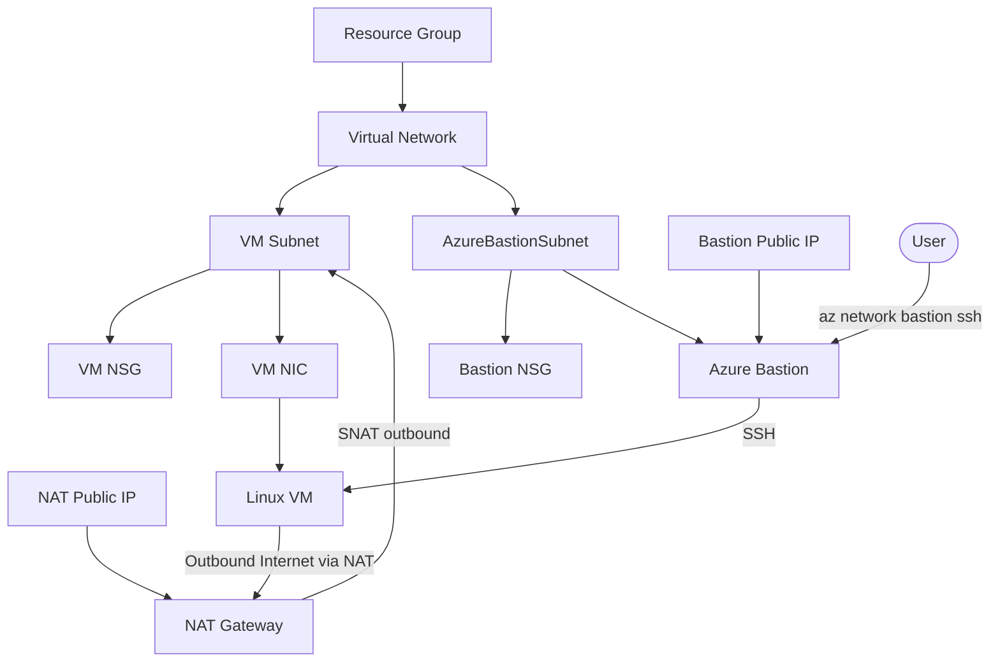

# Azure NAT Gateway Implementation Plan

> **For agentic workers:** REQUIRED SUB-SKILL: Use superpowers:subagent-driven-development (recommended) or superpowers:executing-plans to implement this plan task-by-task. Steps use checkbox (`- [ ]`) syntax for tracking.

**Goal:** Add NAT Gateway to the existing `ch02/` Azure Bastion VM Terraform configuration so the private VM can make outbound internet connections.

**Architecture:** Keep the VM private with no public IP. Add a Standard Static Public IP, NAT Gateway, NAT Gateway public IP association, and VM subnet NAT Gateway association; associate NAT only with the VM subnet, not `AzureBastionSubnet`.

**Tech Stack:** Terraform, HashiCorp AzureRM provider, Azure NAT Gateway, Azure Public IP, Azure Virtual Network subnet association.

---

## File Structure

- Modify `ch02/main.tf`: add four NAT Gateway-related resources with Japanese comments.
- Modify `ch02/outputs.tf`: output the NAT Gateway ID and outbound public IP.
- Modify `ch02/README.md`: update resource list, Mermaid relationship diagram, and outbound-internet explanation.

## Design Decisions

- Do not add a public IP to the VM.
- Associate NAT Gateway only to `azurerm_subnet.vm`.
- Use a separate Standard Static Public IP named `${var.name_prefix}-nat-pip`.
- Use NAT Gateway name `${var.name_prefix}-nat`.
- Set `idle_timeout_in_minutes = 10` for a friendlier learning environment.
- Do not add explicit outbound NSG rules; the VM NSG currently relies on Azure default outbound allow rules, keeping this change focused on NAT.

### Task 1: Add NAT Gateway resources

**Files:**
- Modify: `ch02/main.tf`

- [ ] **Step 1: Insert NAT resources after `azurerm_bastion_host.this` and before `azurerm_network_interface.vm`**

```hcl
# NAT Gateway に割り当てるアウトバウンド通信用の静的パブリック IP
resource "azurerm_public_ip" "nat" {
  name                = "${var.name_prefix}-nat-pip"
  location            = azurerm_resource_group.this.location
  resource_group_name = azurerm_resource_group.this.name
  allocation_method   = "Static"
  sku                 = "Standard"
  tags                = var.tags
}

# Linux VM のアウトバウンドインターネット通信を提供する NAT Gateway
resource "azurerm_nat_gateway" "this" {
  name                    = "${var.name_prefix}-nat"
  location                = azurerm_resource_group.this.location
  resource_group_name     = azurerm_resource_group.this.name
  sku_name                = "Standard"
  idle_timeout_in_minutes = 10
  tags                    = var.tags
}

# NAT Gateway とアウトバウンド用パブリック IP を関連付ける
resource "azurerm_nat_gateway_public_ip_association" "this" {
  nat_gateway_id       = azurerm_nat_gateway.this.id
  public_ip_address_id = azurerm_public_ip.nat.id
}

# VM サブネットに NAT Gateway を関連付け、VM からの外向き通信を SNAT する
resource "azurerm_subnet_nat_gateway_association" "vm" {
  subnet_id      = azurerm_subnet.vm.id
  nat_gateway_id = azurerm_nat_gateway.this.id
}
```

- [ ] **Step 2: Format Terraform**

Run: `terraform -chdir=ch02 fmt`

Expected: command exits 0 and formats `main.tf`.

### Task 2: Add NAT outputs

**Files:**
- Modify: `ch02/outputs.tf`

- [ ] **Step 1: Insert NAT outputs after `bastion_public_ip_address`**

```hcl
output "nat_gateway_id" {
  description = "Resource ID of the NAT Gateway."
  value       = azurerm_nat_gateway.this.id
}

output "nat_gateway_public_ip_address" {
  description = "Public IP address used by NAT Gateway for outbound SNAT."
  value       = azurerm_public_ip.nat.ip_address
}
```

- [ ] **Step 2: Format Terraform**

Run: `terraform -chdir=ch02 fmt`

Expected: command exits 0 and formats `outputs.tf`.

### Task 3: Update README documentation

**Files:**
- Modify: `ch02/README.md`

- [ ] **Step 1: Update the resource list to include NAT Gateway resources**

Replace the resource list with:

```markdown
- Resource Group
- Virtual Network
- VM 用 subnet
- `AzureBastionSubnet`
- VM subnet 用 NSG
- Azure Bastion subnet 用 NSG
- Azure Bastion 用 Public IP
- Azure Bastion
- NAT Gateway 用 Public IP
- NAT Gateway
- VM Subnet NAT Gateway 関連付け
- Network Interface
- Linux VM
```

- [ ] **Step 2: Update the explanatory paragraph after the resource list**

Use this paragraph:

```markdown
VM には Public IP を付けません。SSH は Azure Bastion 経由で行います。
VM からインターネットへのアウトバウンド通信（`apt-get update` など）は NAT Gateway 経由で行います。
```

- [ ] **Step 3: Replace the Mermaid diagram**

```markdown

```

- [ ] **Step 4: Add a NAT verification note after the Bastion SSH section**

```markdown
## VM からのアウトバウンド通信確認

Bastion 経由で VM に SSH した後、次のように外向き通信を確認できます。

```bash
curl -s ifconfig.me
sudo apt-get update
```

`curl -s ifconfig.me` の結果は Terraform output の `nat_gateway_public_ip_address` と一致する想定です。
```

### Task 4: Validate the NAT Gateway update

**Files:**
- Modify only if validation reports syntax or formatting issues: `ch02/*.tf`, `ch02/README.md`

- [ ] **Step 1: Validate Terraform formatting**

Run: `terraform -chdir=ch02 fmt -check`

Expected: command exits 0 with no file names printed.

- [ ] **Step 2: Validate Terraform configuration**

Run: `terraform -chdir=ch02 validate`

Expected: `Success! The configuration is valid.`

- [ ] **Step 3: Create a Terraform plan**

Run: `mise exec azure-cli -- terraform -chdir=ch02 plan -no-color`

Expected: Terraform reports additions for NAT Gateway resources and no unexpected destroy/replace actions.

## Implementation Log
<!-- Implementer appends one line per attempt: [YYYY-MM-DD] attempt #N -> STATUS | commit-or-failure-signature -->

[2026-06-21] attempt #1 -> DONE | no commit (user requested no commit)

## Review Findings
<!-- This template is also defined in commands/plan.md. Keep them in sync on every edit. -->

### Reviewer Raw Findings
<!-- Orchestrator copies @reviewer's structured findings verbatim here when invoking @reviewer during a workflow. Direct /review-* calls do not write here. Raw findings are review input, not implementation instructions. -->

#### [2026-06-21] implementation -> APPROVE
[2026-06-21] implementation -> APPROVE | no findings

### Orchestrator Adjudication
<!-- Orchestrator appends adjudication tables for workflow reviews. Only ACCEPT rows are implementation instructions: | ID | Severity | Decision | Reason | Action | -->

## Deviations from Plan
<!-- Implementer documents intentional deviations and reasons. -->

## Open Questions
<!-- Any agent adds questions for orchestrator or oracle. -->
